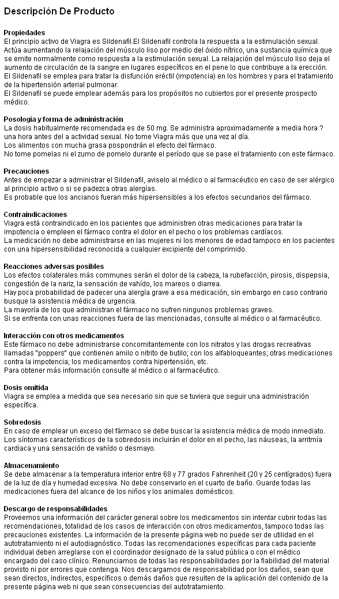
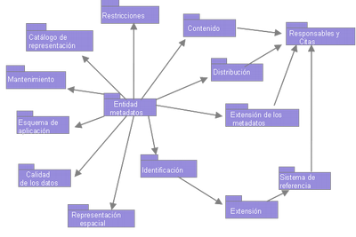
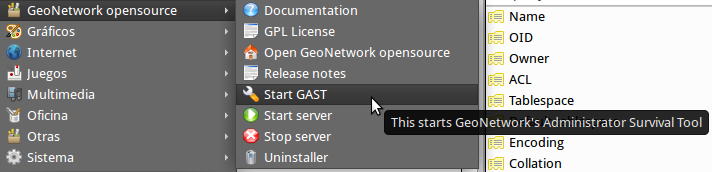
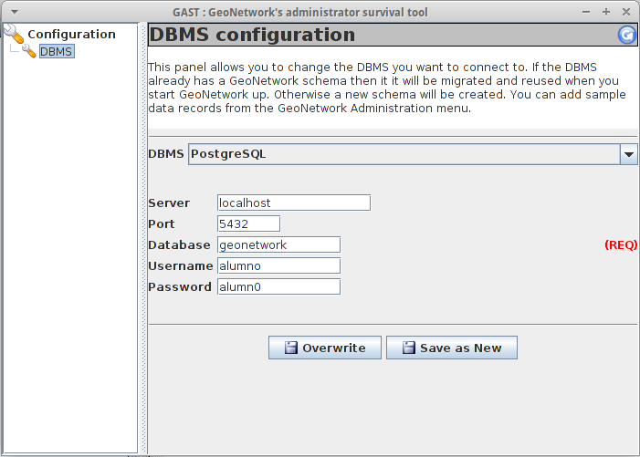

.. |GN| replace:: **GeoNetwork**

*************************************
GeoNetwork como catálogo de Metadatos
*************************************

.. note::

	=================  ====================================================
	Fecha              Autores
	=================  ====================================================           
	1 Diciembre 2012   * Micho García (micho.garcia@geomati.co)
	=================  ====================================================

	©2012 Micho García
	
	Excepto donde quede reflejado de otra manera, la presente documentación se halla bajo licencia : Creative Commons (Creative Commons - Attribution - Share Alike: http://creativecommons.org/licenses/by-sa/3.0/deed.es)
	
Introducción a los metadatos
============================

¿Qué son los metadatos?
-----------------------
Los metadatos ayudan a organizar y mantener la inversión de una organización en los datos y proporciona además esa información en forma de catálogo. El desarrollo coordinado de los metadatos evita duplicar esfuerzos asegurando que la organización es consciente de la existencia del conjuntos de datos.[`1`_]

Los usuarios pueden localizar todos los datos geoespaciales y los importantes asociados a un área de interés.

Los metadatos aparecen en muchos más sitios de los que se piensa, por ejemplo:

	
Estos no son mas que información (datos) sobre la información (mas datos).

Cuando realizamos un fotografía con nuestro terminal, se almacenan en dicha fotografía cierta información como el modelo de la cámara del terminal, la posición donde se tomó la foto (si se dispone de GPS), valores de exposición... cuanta más información se disponga sobre la fotografía, tendremos mejor disposición a la hora de buscar en nuestra colección de fotografías. Por ejemplo, podremos buscar las fotografías que hicimos en determinado lugar o cerca de él, las que se hicieron con una u otra cámara... Famosos portales de fotografía hacen un uso intensivo de los metadatos a la hora de catalogar esa información.

Esto es posible porque los metadatos de las fotografías se engloban dentro de una especificación Exif que han adoptado muchos de los fabricantes de cámaras y que están implementados en los tipos de archivos ampliamente extendidos como JPEG o TIFF.[`2`_]

La función de los metadatos sobre la información espacial es la misma, la de aportar más información sobre esta información espacial, por definirlo de una manera más formal: "los metadatos son "datos sobre los datos". Describen el contenido, la calidad, la condición y otras características de los datos. Ayudan a una persona o sistema inteligente a localizar y entender los datos espaciales disponibles."[`3`_]

Para que los metadatos sean facilmente explotables deben de tener un orden, deben de poder ser entendidos por cualquier persona o sistema sin necesidad de ser explicados. Si en el caso de las fotografías, la posición, por ejemplo, la guardásemos en un campo nombrado de diferente manera en cada dispositivo, la información del metadato sería dificilmente recuperable y explotable, por eso, en el caso de las fotografías los fabricantes asumen la especificación que sería similar a un estandar.

En el caso de los metadatos geográficos, se han definido diferentes estándares para el manejo de los metadatos. Algunos se describen a continuación.

Definición de algunas de las normas
-----------------------------------

ISO19115:2033 - Geographic Information Metadata
^^^^^^^^^^^^^^^^^^^^^^^^^^^^^^^^^^^^^^^^^^^^^^^
"La Norma Internacional ISO 19115:2003 - Geographic Information - Metadata, define el modelo requerido para describir información geográfica y servicios. Proporciona información sobre la identificación, la extensión, la calidad, el modelo espacial y temporal, la referencia espacial y la distribución de los datos geográficos digitales.

La Norma International define:

* Secciones de metadatos obligatorios y condicionales, entidades de metadatos y elementos de metadatos;
* El conjunto mínimo de metadatos requeridos para soportar todo el rango de aplicaciones de metadatos (descubrimiento de datos, determinación de la idoneidad de unos para un uso, acceso a los datos, transferencia de datos y utilización de datos digitales);
* Elementos de metadatos opcionales, para permitir una descripción normalizada más amplia de los datos geográficos, si así se requiere;
* Un método para crear extensiones de metadatos para adaptarse a necesidades especializadas."[`4`_]

Se compone a su vez de diferentes elementos:

En esta imagen se ve como se relacionan los diferentes elementos que componen la norma con el Elemento Metadato que es el núcleo de la misma. En su totalidad la norma ISO19115 dispone de mas de 400 campos que pueden ser alimentados con información. 

A pesar de la extensión de la norma, esta dispone de un núcleo - **Core** de metadatos de obligado cumplimiento que todo perfíl que se base en esta norma debe incorporar de manera obligatoria.

ISO19139 - Geographic Information- Metadata -- XML schema implementation
^^^^^^^^^^^^^^^^^^^^^^^^^^^^^^^^^^^^^^^^^^^^^^^^^^^^^^^^^^^^^^^^^^^^^^^^
"La norma ISO 19115 proporciona una estructura para describir información geográfica mediante elementos de metadatos y establece una terminología común para los mismos pero no desarrolla como poder llevar a cabo su implementación."[`5`_]

Lo que plantea esta norma es una implementación en XML de la ISO19115:2003 basandose en el uso de los XML-Schema[`6`_], documentos que definen la estructura que debe tener el documento XML. Una de las definiciones que se disponen en el documento es el uso de espacios de nombre permitiendo de esa manera el uso de etiquetas con el mismo nombre pero que puedan tener significados diferentes en contextos diferentes.

`Ejemplo de un metadato implementado con la norma ISO19139`_

.. _`Ejemplo de un metadato implementado con la norma ISO19139`: metadatos/metadato3_prueba.xml

ISO15836:2003 - Information and Documentation- The Dublin Core Metadata Element Set
^^^^^^^^^^^^^^^^^^^^^^^^^^^^^^^^^^^^^^^^^^^^^^^^^^^^^^^^^^^^^^^^^^^^^^^^^^^^^^^^^^^
Esta set de metadatos, creado en 1995, promueve la difusión de estándares/normas de metadatos interoperables y el desarrollo de vocabularios de metadatos especializados que permitan la construcción de sistemas de búsqueda de información más inteligentes. Se trata de un estandar para la descripción de todo tipo de recursos de manera independiente de su formato, área de especilización y está desarrollado para que pueda ser utilizado por sistema de búsquedas inteligentes.

Su simplicidad, dispone de quince descriptores básicos, hace que esté siendo adoptada por muchas organizaciones dedicadas a la IG. Mediante el uso de este estándar se posibilita la incorporación más rápida de datos a un catálogo o la posibilidad de, mezclandolos con las ISO19115 utilizarlos como una primera aproximación al metadato más desarrollado de la ISO19115.

Este estandar está propuesto por la OGC como modelo básico de búsqueda y presentación de documentos. Asimismo Dublin Core se puede utilizar combinandolo con RDF, el "lenguaje" de la web semántica.

CSW el estandar OGC para servir los metadatos
=============================================
CSW, o Catalog Service for the Web[`7`_], se trata de un estandar de la OGC para la publicación, descubrimiento y explotación de los metadatos. Lo que hace es exponer en la web un catálogo de metadatos. Está desarrollado por la OGC y su última versión en el momento de escribir este documento era la 2.0.2. Generalmente los estándares de servicios de la OGC definen una serie de operaciones y resultados que se deben cumplir para incorporar el estandar. En el caso del CSW se definirán las siguientes operaciones:

GetCapabilities
---------------
Que, al igual que en el resto de servicios de la OGC donde se implementa esta operación (W*S), nos devolverá una descripción de las propiedades de las operaciones de las que dispone el servidor.

DescribeRecord
--------------
Devuelve información que describe los registros basada en el model de la información soportado por el catálogo sobre el que se ejecuta la consulta. Describe como se muestran los registros, como están formados.

GetRecords
----------
Devolverá los registros que cumplan las condiciones de filtrado que le podemos enviar. En esta operación es donde tenemos disponible la capacidad para obtener los metadatos que deseamos. La infinita capacidad de filtrado que nos permite, hace que sea muy potente a la hora de explotar el servicio de catálogo.

GetRecordByID
-------------
Devuelve el registro que tenga el ID que se le envíe en la consulta.

GeoNetwork implementa la última versión de CSW y permite su configuración a través del panél de administración y su testeo desde su CSW ISO Profile Test, herramienta muy interesante para el uso y entendimiento del estándar.

GeoNetwork
==========
Instalación y configuración
---------------------------
En la versión 2.10 de Geonetwork se ha simplificado mucho el proceso de instalación. Para disponer de |GN| en nuestro servidor, descargaremos de la web de |GN| el instalador correspondiente al sistema operativo que estemos usando. En el caso de Linux, descargaremos el archivo .jar. Para ejecutar este archivo deberemos tener instalada la versión 6 de Java. Esto lo podremos comprobar ejecutando en un terminal::

	$ java -version
	
que nos mostrará algo del estilo::

	java version "1.6.0_27"
	OpenJDK Runtime Environment (IcedTea6 1.12.6) (6b27-1.12.6-1ubuntu0.12.04.4)
	OpenJDK Client VM (build 20.0-b12, mixed mode, sharing)
	
Dependiendo de la plataforma sobre la que estemos trabajando. En caso de no disponer de la versión 6 de Java se recomienda buscar en la web el proceso de instalación de la misma.

Una vez instalada correctamente la versión de Java, procederemos a instalar el servidor |GN|, para ello ejecutaremos::

	$ java -jar geonetwork-install-2.X.X-X.jar

lo que nos arrancará un instalador que nos guiará durante todo el proceso. Llegados un punto en la instalación, nos pedirá si deseamos instalar GAST. GAST, acrónimo de Geonetwork's Administration Survival Tool[`8`_]. GAST es una herramienta de ayuda a la administración de |GN|. Actualmente la mayoría de las funcionalidades están migradas al panél de administración de |GN|, pero sigue manteniendo un interfaz de usuario para una configuración básica de la conexión JDBC con la base de datos.

Arquitectura de GeoNetwork
--------------------------
|GN| se apoya en diferentes tipos de software para llevar a cabo su tarea. En lineas generales se trata de una base de datos que permite el almacenamiento de los metadatos, un motor de búsqueda de texto en esos metadatos y una herramienta que adapte esos metadatos a las diferentes plantillas. Describiremos una a una las tecnologías:

Base de datos
^^^^^^^^^^^^^
Por defecto |GN| trae instalada una base de datos H2[`9`_]. Se trata de una base de datos que puede funcionar embebida. En el caso de que tengamos a nuestra disposición una base de datos diferente, podremos configurar nuestro |GN| para que utilice nuestra base de datos en vez de la base de datos H2 que trae por defecto. Para cambiar esta base de datos podremos utilizar la herramienta GAST.

Desde el menu de |GN| arrancaremos GAST. En el listado de DBMS, seleccionaremos el que nos interese, en nuestro caso **PostgreSQL**, y añadiremos los datos necesarios para generar la cadena de conexión. Una vez hecho esto, lo guardamos en caso de que sea nuevo, o lo sobreescribimos y reiniciamos el servidor.

Si vamos a la base de datos, veremos que ha generado el modelo de datos necesario para el manejo de |GN|.

Contenedor de servlets y servidor web
^^^^^^^^^^^^^^^^^^^^^^^^^^^^^^^^^^^^^
|GN| dispone de una parte web a través de la se publican los servicios y se accede a la funcionalidad y visualización de los metadatos. Para este fin |GN| dispone de Jetty[`11`_], un contenedor de servlets al estilo de Apache Tomcat, que permite funcionar embebido en el proyecto. Jetty ofrece un servicio de calidad[`12`_] por lo que se puede mantener. En caso de que se desee el uso de otro contenedor de servlets, |GN| es perfectamente funcional en Apache Tomcat al tratarse de una aplicación relizada en Java.

La importancia del contenedor de servlets, es que |GN| ha desarrollado toda su funcionalidad mediante servicios web. De esta manera, cuando estamos insertando un metadato, estamos realizando una llamada al servicio::

	Url:
	http://localhost:8080/geonetwork/srv/en/metadata.insert
	
	Mime-type:
	application/xml

	Post request:
	<?xml version="1.0" encoding="UTF-8"?>
	<request>
	  <group>2</group>
	  <category>_none_</category>
	  <styleSheet>_none_</styleSheet>
	  <data><![CDATA[
		 <gmd:MD_Metadata xmlns:gmd="http://www.isotc211.org/2005/gmd"
		              xmlns:xsi="http://www.w3.org/2001/XMLSchema-instance"
		 ...
		    </gmd:DQ_DataQuality>
		   </gmd:dataQualityInfo>
		 </gmd:MD_Metadata>]]>
	  </data>
	</request>
	
Hay una descripción de los servicios de |GN| en [`13`_]

Apache Lucene
^^^^^^^^^^^^^

La funcionalidad de |GN| al final, es la de buscar en cantidades ingentes de información tipo texto. Keywords, titles... se tratan de textos que están almacenados en la bsae de datos y que deben poder ser buscados desde |GN|. Para realizar esto hace uso de Apache Lucene[`14`_]. Apache Lucene es un buscador de texto.

Podremos configurar la Lucene con los campos en los que queramos que nos realice la búsqueda. Para ello deberemos modificar los campos en el archivo `config-lucene.xml` y a su vez las plantillas sobre las que queremos añadir los campos. Con la herramienta Luke[`15`_] podremos acceder al índice de Lucene para manejarlo.

Jeeves
^^^^^^

Jeeves se basa en transformaciones XSLT que permiten un desarrollo rápido y sencillo (a la vez que potente) de interfaces tanto para un usuario como para máquinas (XML).[`20`_]

Z39.50
^^^^^^

"Z39.50 es un protocolo cliente-servidor dirigido a facilitar la búsqueda y recuperación de información en distintos sistemas a través de una misma interfaz. Su aplicación en el mundo de las bibliotecas y de los centros de documentación permite la consulta de recursos distribuidos en distintas bases de datos, desde un mismo punto de acceso." [`18`_]

"|GN| usando el protocolo Z39.50 puede acceder a catálogos remotos y hace que sus datos estén disponibles para otros servicios de catálogo". [`19`_]

Entendiendo XML, XML - Schema y XSLT
------------------------------------
XML
^^^

"La tecnología XML busca dar solución al problema de expresar información estructurada de la manera más abstracta y reutilizable posible. Que la información sea estructurada quiere decir que se compone de partes bien definidas, y que esas partes se componen a su vez de otras partes. Entonces se tiene un árbol de trozos de información."[`21`_]

Un ejemplo de XML sería::

	<?xml version="1.0" encoding="UTF-8" ?>
	 
	<Edit_Mensaje>
		  <Mensaje>
		       <Remitente>
		            <Nombre>Nombre del remitente</Nombre>
		            <Mail> Correo del remitente </Mail>
		       </Remitente>
		       <Destinatario>
		            <Nombre>Nombre del destinatario</Nombre>
		            <Mail>Correo del destinatario</Mail>
		       </Destinatario>
		       <Texto>
		            <Asunto>
		                 Este es mi documento con una estructura muy sencilla 
		                 no contiene atributos ni entidades...
		            </Asunto>
		            <Parrafo>
		                 Este es mi documento con una estructura muy sencilla 
		                 no contiene atributos ni entidades...
		            </Parrafo>
		       </Texto>
		  </Mensaje>
	</Edit_Mensaje>
	
"Los documentos denominados como «bien formados» (del inglés well formed) son aquellos que cumplen con todas las definiciones básicas de formato y pueden, por lo tanto, analizarse correctamente por cualquier analizador sintáctico (parser) que cumpla con la norma. Se separa esto del concepto de validez que se explica más adelante.

* Los documentos han de seguir una estructura estrictamente jerárquica con lo que respecta a las etiquetas que delimitan sus elementos. Una etiqueta debe estar correctamente incluida en otra, es decir, las etiquetas deben estar correctamente anidadas. Los elementos con contenido deben estar correctamente cerrados.
* Los documentos XML sólo permiten un elemento raíz del que todos los demás sean parte, es decir, solo pueden tener un elemento inicial.
* Los valores atributos en XML siempre deben estar encerrados entre comillas simples o dobles.
* El XML es sensible a mayúsculas y minúsculas. Existe un conjunto de caracteres llamados espacios en blanco (espacios, tabuladores, retornos de carro, saltos de línea) que los procesadores XML tratan de forma diferente en el marcado XML.
* Es necesario asignar nombres a las estructuras, tipos de elementos, entidades, elementos particulares, etc. En XML los nombres tienen alguna característica en común.
* Las construcciones como etiquetas, referencias de entidad y declaraciones se denominan marcas; son partes del documento que el procesador XML espera entender. El resto del documento entre marcas son los datos «entendibles» por las personas."

XML - Schema
^^^^^^^^^^^^

"XML Schema es un lenguaje de esquema utilizado para describir la estructura y las restricciones de los contenidos de los documentos XML de una forma muy precisa, más allá de las normas sintácticas impuestas por el propio lenguaje XML. Se consigue así una percepción del tipo de documento con un nivel alto de abstracción." [`23`_]

Disponemos del siguiente Schema::

	<?xml version="1.0"?>
	<xs:schema xmlns:xs="http://www.w3.org/2001/XMLSchema" >
		<xs:element name="Employee_Info" type="EmployeeInfoType" />
		<xs:complexType name="EmployeeInfoType">
			<xs:sequence>
				<xs:element ref="Employee" minOccurs="0" maxOccurs="unbounded" />
			</xs:sequence>
		</xs:complexType>
		<xs:element name="Employee" type="EmployeeType" />
		<xs:complexType name="EmployeeType">
			<xs:sequence >
				<xs:element ref="Name" />
				<xs:element ref="Department" />
				<xs:element ref="Telephone" />
				<xs:element ref="Email" />
			</xs:sequence>
			<xs:attribute name="Employee_Number" type="xs:int" use="required"/>
		</xs:complexType>
		<xs:element name="Name" type="xs:string" />
		<xs:element name="Department" type="xs:string" />
		<xs:element name="Telephone" type="xs:string" />
		<xs:element name="Email" type="xs:string" />
	</xs:schema>
	
Y queremos definir nuestro XML en función de ese Schema::

	<?xml version="1.0"?>
	<Employee_Info
	  xmlns:xsi="http://www.w3.org/2001/XMLSchema-instance"
	  xsi:noNamespaceSchemaLocation="employee.xs">
	  <Employee  Employee_Number="105">
		 <Name>Masashi Okamura</Name>
		 <Department>Design Department</Department>
		 <Telephone>03-1452-4567</Telephone>
		 <Email>okamura@xmltr.co.jp</Email>
	  </Employee>
	  <Employee  Employee_Number="109">
		 <Name>Aiko Tanaka</Name>
		 <Department>Sales Department</Department>
		 <Telephone>03-6459-98764</Telephone>
		 <Email>tanaka@xmltr.co.jp</Email>
	  </Employee>
	</Employee_Info>
	
Podremos probar que se trata de un documento que se adapta al XML - Schema definido en cualquier validador de XML - Schema online como este:

http://www.utilities-online.info/xsdvalidation
	
El Schema marca las reglas que debe cumplir un determinado documento XML.

XSLT
^^^^

"XSLT o Transformaciones XSL es un estándar de la organización W3C que presenta una forma de transformar documentos XML en otros e incluso a formatos que no son XML. Las hojas de estilo XSLT - aunque el término de hojas de estilo no se aplica sobre la función directa del XSLT - realizan la transformación del documento utilizando una o varias reglas de plantilla. Estas reglas de plantilla unidas al documento fuente a transformar alimentan un procesador de XSLT, el que realiza las transformaciones deseadas poniendo el resultado en un archivo de salida, o, como en el caso de una página web, las hace directamente en un dispositivo de presentación tal como el monitor del usuario."[`22`_]

Creación y publicación de metadatos
------------------------------------

Para la creación de metadatos lo primero es tener los permisos necesarios para poder insertar registros. Como mínimo necesitamos el perfíl de ``Editor`` para poder incluir datos en el sistema.

Después tendremos que tener cargadas nuestras plantillas del perfíl que estemos usando sobre las que se apoyarán los metadatos. Para cargar las plantillas de metadatos debemos desde ``Administración`` -> ``Add templates`` y seleccionaremos las plantillas que deseamos cargar.

Una vez que tenemos las plantillas cargadas, desde la pestaña de Administración -> New Metadata, seleccionamos la plantilla sobre la que queremos trabajar y el grupo de usuarios para el que estará disponible.

Lo siguiente es utilizar el editor para rellenar los valores de los metadatos.

Importación de metadatos
^^^^^^^^^^^^^^^^^^^^^^^^
Otra manera de incluir metadatos en nuestro sistema es mediante la importación de los mismos. Para ello utilizaremos la herramienta de importación de metadatos de |GN|. Primero obtendremos un metadato que deseemos importar. Podemos generarlo desde una herramienta de creación de metadatos como CatMEdit[`16`_] o podemos descargar algú metadato de un catálogo ya existente, como este[`17`_].

Desde la página de ``Administración` -> ``Metadata Insert`` rellenaremos los campos e insertaremos para tener incluido en nuestro catálogo el metadato.

También podremos importar metadatos desde un directorio simplemente utilizando la opción ``Batch Import``. Para ello desde la pestaña de administración, seleccionamos el directorio donde se almacenan los metadatos y ejecutamos. Debemos definir la plantilla que vamos a utilizar a la hora de cargarlos.

La importación se puede realizar a través de archivos MEF (Metadata Exchange File), archivos creados por |GN| que adpotan un determinado formato y que permiten la exportación e importación masiva de metadatos permitiendo realizar backups a través de ellos. Para una definición completa de MEF se recomienda visitar la web de |GN| [_`24`]

Consumo de metadatos de diferentes nodos
----------------------------------------

Mediante |GN| tenemos la posibilidad de consumir metadatos de diferentes nodos. Esta tal vez es una de las características más potentes de |GN| que nos permite compartir los metadatos de otros catálogos desde el nuestro. Para ello, |GN| dispone de un proceso de ``Harvesting``, recolección, mediante el cual programamos las rutas en las que se encuentran los otros catálogos, servicios, instancias de Thredds... desde las que queremos obtener los metadatos y definiremos cuando queremos que nuestro servidor haga la recolección de datos.

Para activar este proceso debemos ir a ``Administración`` -> ``Harvesting Management`` y definir un nuevo nodo desde el que obtener más información.

Configuración del servidor CSW
------------------------------

CSW es el estandar que utiliza |GN| para explotar los metadatos. CSW viene activado por defecto en |GN|. Para configurarlo y realizar pruebas sobre el servidor CSW desde la pestaña de ``Administración`` -> ``CSW Server COnfiguration`` y ahí modificaremos los parámetros que nos interesen. Principalmente definiremos los metadatos de nuestro servicio CSW. Desde esa misma pestaña, podemos acceder al ``CSW ISO Profile Test`` desde donde podremos probar las diferentes operaciones de las que disponemos en el estandar CSW.

.. _`1`: http://www.magrama.gob.es/es/cartografia-y-sig/ide/catalogo_metadatos/metadatos.aspx 
.. _`2`: http://es.wikipedia.org/wiki/Exchangeable_image_file_format
.. _`3`: http://www2.topografia.upm.es/pdi/m.manso/docs/trabajo-metadatos.pdf
.. _`4`: http://metadatos.ign.es/metadatos/Normativa/normas-de-la-familia-iso-19100/iso-19115
.. _`5`: http://iaaa.cps.unizar.es/curriculum/08-Publicaciones-Articulos/art_2008_Mapping_Normas.pdf
.. _`6`: http://es.wikipedia.org/wiki/XML_Schema
.. _`7`: http://www.opengeospatial.org/standards/specifications/catalog
.. _`8`: http://geonetwork-opensource.org/manuals/trunk/eng/users/admin/gast/index.html
.. _`9`: http://www.h2database.com/html/main.html
.. _`10`: http://database-management-systems.findthebest.com/compare/16-43/H2-vs-PostgreSQL
.. _`11`: http://www.eclipse.org/jetty/
.. _`12`: https://www.webtide.com/choose/jetty.jsp
.. _`13`: http://geonetwork-opensource.org/manuals/2.10.2/eng/developer/xml_services/index.html
.. _`14`: http://lucene.apache.org/core/
.. _`15`: http://code.google.com/p/luke/
.. _`16`: http://catmdedit.sourceforge.net/download.html
.. _`17`: http://www.magrama.gob.es/metadatos/
.. _`18`: http://es.wikipedia.org/wiki/Z39.50
.. _`19`: http://es.wikipedia.org/wiki/GeoNetwork_opensource
.. _`20`: http://delawen.com/es/tag/jeeves/
.. _`21`: http://es.wikipedia.org/wiki/Extensible_Markup_Language
.. _`22`: http://es.wikipedia.org/wiki/XSLT
.. _`23`: http://es.wikipedia.org/wiki/XML_Schema
.. _`24`: http://geonetwork-opensource.org/manuals/trunk/eng/developer/mef/
